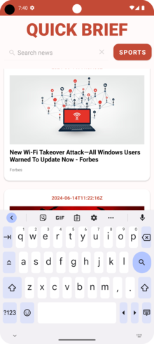

# QUICK BRIEF APP

   

## Opis
Projekt Quick Brief to mobilna aplikacja służąca do przeglądania najnowszych artykułów prasowych z różnych kategorii takich jak wiadomości światowe, sport, technologia i zdrowie. Aplikacja korzysta z API News do pobierania aktualnych danych prasowych i prezentowania ich w przyjaznym interfejsie użytkownika.

## Funkcje
1. **Wybór kategorii**: Użytkownicy mogą wybierać spośród różnych kategorii (światowe, sport, technologia, zdrowie), aby przeglądać artykuły prasowe dostosowane do ich zainteresowań.

2. **Funkcja wyszukiwania**: Aplikacja udostępnia pasek wyszukiwania, gdzie użytkownicy mogą wprowadzać słowa kluczowe, aby wyszukać określone tematy lub artykuły prasowe.

3. **Dynamiczna zawartość**: Artykuły prasowe są dynamicznie pobierane i wyświetlane w RecyclerView, co umożliwia płynne przewijanie i efektywne ładowanie treści.

4. **Szczegółowy widok artykułu**: Dotknięcie artykułu otwiera szczegółowy widok zawierający tytuł artykułu, źródło, obraz (jeśli dostępny) oraz link do przeczytania pełnego artykułu online.

5. **Wskaźnik postępu**: Wizualne wskazanie (pasek postępu) pokazuje, kiedy artykuły prasowe są pobierane z API, dostarczając informacji zwrotnej dla użytkownika.

## Użyte technologie
- **Android Studio**: Środowisko programistyczne (IDE) do rozwijania aplikacji Android.
- **Java**: Język programowania używany do kodowania logiki aplikacji Android.
- **RecyclerView**: Komponent interfejsu użytkownika do wydajnego wyświetlania listy lub siatki artykułów prasowych.
- **News API**: Zewnętrzne API używane do pobierania bieżących danych prasowych na podstawie określonych kategorii i zapytań wyszukiwania.
- **Picasso**: Biblioteka ładowania obrazów dla Androida, używana do ładowania i wyświetlania obrazów z adresów URL.

## Instrukcje instalacji
1. **Klonowanie repozytorium**: Sklonuj repozytorium z [adres URL do repozytorium GitHub].

2. **Otwórz projekt w Android Studio**: Uruchom Android Studio i otwórz sklonowany projekt.

3. **Budowanie i uruchamianie**: Podłącz urządzenie Android lub skorzystaj z emulatora, następnie zbuduj i uruchom projekt, aby zainstalować aplikację Quick Brief na urządzeniu.

## Użycie
- Po uruchomieniu aplikacji Quick Brief, użytkownicy są witani wyborem kategorii (Świat, Sport, Technologia, Zdrowie).
- Wybór kategorii wczytuje najnowsze artykuły prasowe z tej kategorii.
- Użytkownicy mogą również użyć paska wyszukiwania, aby wprowadzić słowa kluczowe i wyszukać określone tematy lub artykuły.
- Dotknięcie dowolnego artykułu otwiera podgląd z tytułem artykułu, źródłem i obrazem (jeśli jest dostępny), lub kliknij link, aby przeczytać pełny artykuł online.

---

